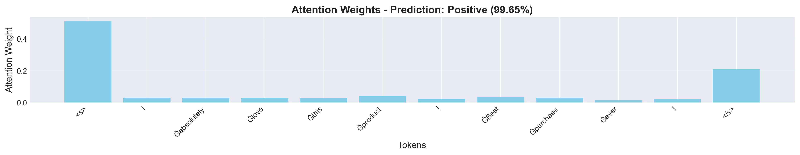
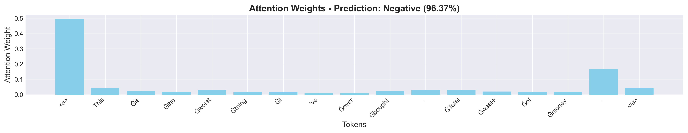
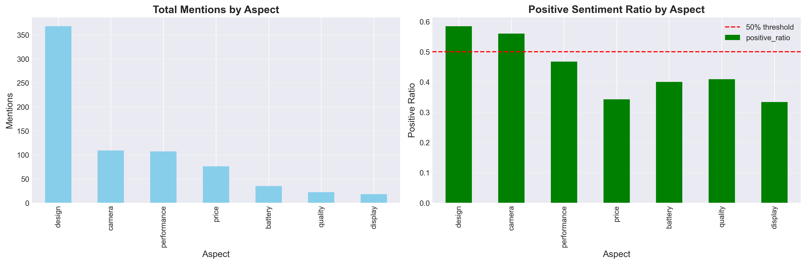

# Twitter Sentiment Analysis with RoBERTa

Fine-tuned RoBERTa transformer model for binary sentiment classification on Twitter data.

## Project Overview

This project implements a production-ready sentiment analysis system using transfer learning with RoBERTa. The model classifies tweets into positive or negative sentiment with high accuracy and includes a complete deployment pipeline.

## Performance Metrics

| Metric | Score |
|--------|-------|
| Test Accuracy | 85.53% |
| Precision | 85.61% |
| Recall | 85.53% |
| F1-Score | 85.52% |

## Live Demo

**Hugging Face Space:** https://huggingface.co/spaces/Jaswanth10/twitter_Sentiment_roberta

## Key Features

- Binary sentiment classification (Positive/Negative)
- Real-time predictions with confidence scores
- Batch processing via CSV upload
- REST API with FastAPI
- Interactive web interface with Streamlit
- Model interpretability through attention visualization
- Named Entity Recognition for product/brand extraction
- Aspect-based sentiment analysis

## Results Visualizations

### Model Performance


**Classification Report:**

```
              precision    recall  f1-score   support

    Negative     0.8395    0.8785    0.8585      4988
    Positive     0.8726    0.8321    0.8519      4990

    accuracy                         0.8553      9978
   macro avg     0.8560    0.8553    0.8552      9978
weighted avg     0.8561    0.8553    0.8552      9978
```

### Training Progress


**Training Details:**
- Epochs: 5
- Best Epoch: 3 (Val Acc: 86.59%)
- Training Time: ~4-5 hours
- Final Best Validation Accuracy: 86.59%

### Attention Visualization Examples


*Example: Positive sentiment - Model focuses on sentiment-bearing words*


*Example: Negative sentiment - Attention on negative indicators*

### Aspect-Based Sentiment Analysis


*Sentiment distribution across different product aspects*

## Technical Stack

**Model Architecture:**
- Base Model: RoBERTa-base (pretrained)
- Fine-tuning: Sentiment140 dataset
- Parameters: 124.6 million

**Technologies:**
- PyTorch 2.10.0+cu130
- Hugging Face Transformers 4.57.6
- FastAPI 0.109.0
- Streamlit 1.29.0
- Optuna for hyperparameter optimization

## Dataset

**Source:** Sentiment140  
**Original Size:** 1,600,000 tweets  
**Sample Used:** 100,000 tweets

**Data Split:**
- Training: 79,817 samples
- Validation: 9,977 samples
- Test: 9,978 samples

**Class Distribution:** Balanced (50% positive, 50% negative)

## Model Training

### Preprocessing Pipeline

1. URL removal
2. Mention removal (@username)
3. Hashtag preservation (sentiment signals)
4. Emoji preservation (sentiment indicators)
5. Contraction expansion
6. Lowercasing
7. Whitespace normalization

### Models Trained

**1. BERT Baseline**
- Model: bert-base-uncased
- Test Accuracy: 85.11%
- Parameters: 109.5 million
- Purpose: Establish baseline

**2. RoBERTa**
- Model: roberta-base
- Test Accuracy: 85.50%
- Parameters: 124.6 million
- Improvement: +0.39%

**3. Optimized RoBERTa (Final)**
- Hyperparameter tuning: Optuna (20 trials)
- Final Test Accuracy: 85.53%
- Best Validation Accuracy: 86.59%
- Total Improvement: +0.42%

### Hyperparameters (Optuna-Optimized)

```python
MAX_LENGTH = 128
BATCH_SIZE = 32
LEARNING_RATE = 1.98e-05
WARMUP_STEPS = 226
WEIGHT_DECAY = 0.0872
EPOCHS = 5
```

**Best Trial:** Trial 1 (Val Acc: 86.79%)

## Project Structure

```
Twitter_sentiment_Analysis_NLP/
├── notebooks/
│   ├── 1_EDA.ipynb
│   ├── 2_preprocessing.ipynb
│   ├── 3_tokenization.ipynb
│   ├── 4_train_BERT.ipynb
│   ├── 5_train_roBERTa.ipynb
│   ├── 6_optuna_tuning.ipynb
│   ├── 7_final_best_model.ipynb
│   └── 8_ner_extraction.ipynb
├── src/
│   ├── preprocessing/
│   │   └── text_cleaner.py
│   └── models/
│       └── dataset.py
├── config/
│   └── training_config.py
├── api/
│   └── main.py
├── data/
│   ├── raw/
│   └── processed/
├── models/
│   └── checkpoints/
├── results/
│   ├── plots/
│   └── reports/
├── app.py
├── requirements.txt
└── README.md
```

## Installation and Usage

### Local Setup

```bash
# Clone repository
git clone https://github.com/jaswanth123-2/Twitter_sentiment_Analysis_NLP
cd Twitter_sentiment_Analysis_NLP

# Install dependencies
pip install -r requirements.txt
```

### Run Streamlit UI

```bash
streamlit run app.py
```

Access at: http://localhost:8501

### Run FastAPI

```bash
cd api
uvicorn main:app --reload
```

API docs at: http://localhost:8000/docs

### API Usage Examples

**Single Prediction:**

```bash
curl -X POST "http://localhost:8000/predict" \
  -H "Content-Type: application/json" \
  -d '{"text": "I love this product!"}'
```

**Response:**
```json
{
  "text": "I love this product!",
  "sentiment": "Positive",
  "confidence": 0.9944
}
```

**Batch Prediction:**

```bash
curl -X POST "http://localhost:8000/predict_batch" \
  -H "Content-Type: application/json" \
  -d '{"texts": ["Great product", "Terrible service", "Not sure"]}'
```

## Advanced Features

### Named Entity Recognition

Extracts products, brands, and organizations from tweets to analyze sentiment by entity.

**Output Files:**
- `results/entity_sentiment_analysis.csv`

### Aspect-Based Sentiment Analysis

Analyzes sentiment for specific product aspects:
- Camera quality
- Battery life
- Display
- Performance
- Design
- Price
- Overall quality

### Attention Visualization

Visualizes which words the model focuses on during prediction.

**Example Outputs:**

**Positive Tweet:**
```
Input: "I absolutely love this product! Best purchase ever!"
Prediction: Positive (99.65%)
Top attended words: product, Best, purchase
```

**Negative Tweet:**
```
Input: "This is the worst thing I've ever bought"
Prediction: Negative (96.37%)
Top attended words: worst, This, ever
```

## Deployment

The model is deployed on Hugging Face Spaces with:
- Platform: Streamlit
- Hardware: CPU
- Accessibility: Public
- URL: https://huggingface.co/spaces/Jaswanth10/twitter_Sentiment_roberta

## Model Performance Analysis

### Strengths

- High accuracy on real-world Twitter data (85.53%)
- Balanced performance (no class bias)
- Fast inference
- Handles informal language, slang, emojis
- Production-ready with API and UI

### Limitations

- Binary classification only (no neutral class)
- Struggles with sarcasm detection
- Mixed sentiments default to stronger sentiment
- English language only
- Context limited to 128 tokens


## Results Summary

### Model Comparison

| Model | Test Accuracy | Training Time | Improvement |
|-------|---------------|---------------|-------------|
| BERT Baseline | 85.11% | ~3 hours | - |
| RoBERTa | 85.50% | ~3 hours | +0.39% |
| RoBERTa + Optuna | 85.53% | ~5 hours | +0.42% |

### Best Model Performance

**Test Set Results:**
- Samples: 9,978
- Correct Predictions: 8,534
- Incorrect Predictions: 1,444
- Accuracy: 85.53%

**Training Progress:**
- Epoch 1: Train Acc 81.67% | Val Acc 85.57%
- Epoch 2: Train Acc 87.25% | Val Acc 85.86%
- **Epoch 3: Train Acc 90.46% | Val Acc 86.59%** ✓ Best
- Epoch 4: Train Acc 93.09% | Val Acc 86.00%
- Epoch 5: Train Acc 94.92% | Val Acc 85.84%

## Technologies and Tools

**Deep Learning:**
- PyTorch 2.10.0+cu130
- Hugging Face Transformers 4.57.6
- CUDA (GPU training support)

**Data Processing:**
- Pandas
- NumPy
- Scikit-learn

**Visualization:**
- Matplotlib
- Seaborn
- Plotly

**API Development:**
- FastAPI 0.109.0
- Uvicorn
- Pydantic

**UI Development:**
- Streamlit 1.29.0

**Optimization:**
- Optuna (20 trials for hyperparameter tuning)

**Deployment:**
- Hugging Face Spaces

## License

MIT License

## Author

**[JASWANTH REDDY]**


## Acknowledgments

- Sentiment140 dataset creators
- Hugging Face for Transformers library
- FastAPI and Streamlit teams
- PyTorch community

## Citation

If you use this project, please cite:

```bibtex
@misc{twitter_sentiment_roberta,
  author = {[V JASWANTH REDDY]},
  title = {Twitter Sentiment Analysis with RoBERTa},
  year = {2025},
  publisher = {GitHub},
  url = {[https://github.com/jaswanth123-2/Twitter_sentiment_Analysis_NLP]}
}
```

---
**Last Updated:** February 2026  
